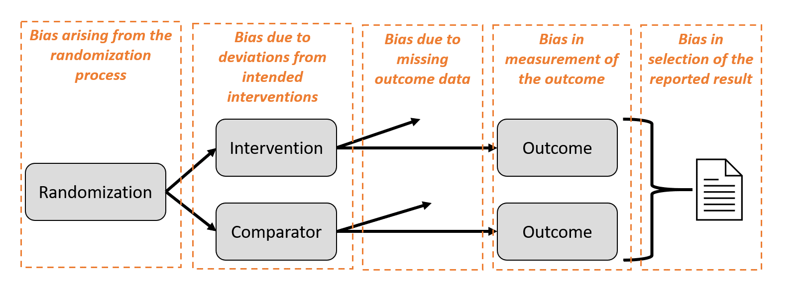

```{r setup, include=FALSE}
options(htmltools.dir.version = FALSE)
knitr::opts_chunk$set(include = FALSE)
```

``` {r, echo = FALSE, message = FALSE}
htmltools::includeCSS("https://raw.githubusercontent.com/malcolmbarrett/kakashi/master/kakashi.css")
library(medrxivr)
cache <- TRUE
library(dplyr)
xaringanExtra::use_xaringan_extra(c("tile_view", "webcam"))
xaringanExtra::use_editable(expires = 1)
```

class: large

## Overview of this course

2 x $\frac{1}{2}$ days 

???

(today and tomorrow)

--

General structure

???

Session introducing domain, followed by practical to apply it

--

Slides/Materials: __hold for link__

???

Available from 

--

Questions

???

Please add questions to the chat - will take breaks to answer them

---

class: large

## What this course will enable you to do

Understand the __background__ and __motivation__ for the RoB2 tool

--

__Apply the tool__ to an example RCT

--

Explore methods for __visualising__ the assessments and __incorporating__ them into your review


---

class: inverse, center, middle

# Context and motivation

---

## What is bias?

A __systematic error__, or deviation from the truth, in results

--

Bias is <u>__not__</u> the same as:

.tricolumn[
.tricolhead[
### Imprecision
]
.small[
Random error due to sampling variation

Reflected in the confidence interval
]
]

--

.tricolumn[
.tricolhead[
### Quality
]
.small[
Bias can occur in <br>well-conducted studies

Not all methodological <br>flaws introduce bias
]
]

--

.tricolumn[
.tricolhead[
### Reporting
]
.small[
Good methods may have been used but not well reported 
]
]

???

The RoB2 tool (and RoB1 tool before it) both seek to measure bias. 
Other tools assessing trials for systematic reviews frequently assess issues related to imprecision, quality and reporting. 

The team that  developed the RoB2 tool are seeking to assess only bias or “Systematic error”

 Imprecision refers to random error. Each time trialists take a sample and measure outcomes, they will get natural variation from the ‘true’ values in the whole population. 
The smaller the sample, the more variability. Imprecision is reflected in the confidence interval around the treatment effect. 

Bias is not the same as quality in study conduct:  The RoB team moved substantially away from methods found in other tools – which often assess – methodological quality” of the trial – or “did the trialists do the best they can do..?” 
Whereas… Bias focuses on “Do I believe the result?”
The terms “Quality” and “bias” are often used interchangeably, but we are more interested in the believability of the result than criticising the efforts made by study authors. 
Even a well conducted study can be at risk of bias, for example, in studies where it’s difficult to blind participants and trial personnel - such as  surgical trials – the study may be conducted very well – have “high quality” - but we still acknowledge the possibility that the lack of blinding might affect the study results. 

Also not all markers of “poor conduct” in trials are relevant to bias. For example, failure to perform a sample size calculation, or to obtain ethical approval, are important markers of study quality, but they are unlikely to have direct implications for risk of  bias.

And 
Bias is not the same as the quality of reporting
Studies rarely have space to report the methods used in exhaustive detail and may often have used rigorous methods even if they are not described in the published paper. 

Reporting is improving with initiatives like the CONSORT statement. It is important not to discriminate against older trials that were published before these initiatives, and for us to be clear- in our  assessments of bias - in these trials – whether our decisions are based on methods reported in the paper, and when the details are not reported in the trial.. .some tools to assess trials for RCTs have confused these issues

---
class: center, middle


.largest[__Bias__]

.larger[wrong answer to the right question]


.largest[
$\neq$
]


.largest[__Generalisability / Indirectness__]

.larger[right answer to the wrong question]


???

Bias also not the same as concerns re generalisability

Indirectness = just because you are not studying the population of interest, doesn't mean the answer is biased.

---
class: large

## Problems with existing tool (RoB 1)

Used simplistically & inconsistently

Modest agreement rates between assessors

No __overall__ risk-of-bias judgement

???

__1__ Guidance not followed, and domains added or removed

<hr>

__2__ This was partly influence by the overuse of the unclear judgement, which was itself ambiguous.

Can provide references for this if you want
<hr>

__3__ Problematic if you want to carry result of forward, which we will explore tomorrow afternoon (__SIGNPOST__)

---

## .center[Motivation for ROB2]

<br>
.pull-left[.center[.larger[More __accurate__]]]
<br>
<br>
???
__1__ more comprehensive
more guidance and structure to improve consistency
versions appropriate to cluster-randomized trials, cross-over trials
<hr>

--
.pull-right[.center[.larger[More __usable__]]]
<br>
<br>
???
???
__2__
clearer guidance, in-built help in reaching judgements
<hr>

--

.pull-left[.center[<br>.larger[More __current__]]]
<br>
???
__3__
incorporates developments in the science (particularly missing data, unblinded trials)
<hr>

--

.pull-right[.center[<br>.larger[More __useful__]]]

???
__4__
overall risk of bias judgement feeds into sensitivity analyses/exploration of heterogeneity
allied to ROBINS-I for non-randomized studies

<hr>

---

class: inverse, center, middle

# RoB2 Key Features

---

## RoB2 is a result-focused tool

It assesses a __single outcome__ at a __single timepoint__

<br>

???
Essentially assessing a single numerical result chosen


More specific than study/outcome based

--

.tricolumn[
.tricolhead[
### Outcome
]

Depression


]

--

.tricolumn[
.tricolhead[
### Measure
]
Beck's Depression<br>Inventory

]

--

.tricolumn[
.tricolhead[
### Time point
]

12 weeks

]

---

## Bias in randomised trials


???

Bias introduced through conduct/dissemination of results

These aspects are based on empirical research and theory

May be familiar, but worth checking how they are defined within the RoB 2 tool

__Note:__ Only for RCTs - for non-randomised studies, check ROBINS-I

__Note:__ for the purposes of this course, we will be focusing on standard RCTS (rather than cluster or other RCTs).

There are additional issues in cross-over trials and cluster-randomized trials, and different versions of RoB 2 have been developed for these designs.


---

## Bias in randomised trials



???

Domains map onto the elements or domains of bias

---

## Domains

All domains are __mandatory__

Additional domains (e.g. "other biases") should not be added

Issues around __funding/COIs __are handled elsewhere

__Reporting biases__ handled elsewhere e.g. ROB-ME

---

## Comparison with RoB 1 Domains

__Hold for table__

---

## The effect of interest


---

## Signalling questions

Reasonably factual __signalling questions__ aim to facilitate judgements and increase transparency

__Example:__ Was the allocation sequence random?

???

Authors encouraged to record rationale and direct quotes

--

Possible responses: .g[‘__Yes__’], .g[‘__Probably yes__’], .r[‘__Probably no__’], .r[‘__No__’], ‘__No information__’

---

## Domain-level judgements

Possible judgements:
* .g[‘Low risk of bias’]
* ‘Some concerns’
* .r[‘High risk of bias’]

???

--

__Algorithms__ provided suggested domain-level judgements

???

Based on responses to signalling questions. We'll introduce these in greater detail later.

--

.box[Suggested risk-of-bias judgements can be over-ridden
]

---

## Overall risk of bias

.left-column[.g[__Low risk of bias__]]
The study is judged to be at __low risk of bias__ for all domains _for this result_.

???

Overall risk of bias judgement follows from the domain-level judgements (can be over-ridden)

--

.left-column[__Some concerns__<br><br>]

The study is judged to be at __some concerns__ in at least one domain _for this result_, and no domains are at high risk of bias


--
.left-column[.r[__High risk of bias__<br><br><br><br><br>]]

`#`1 - The study is judged to be at __high risk of bias__ in at least one domain _for this result_.<br>
--
`#`2 - The study is judged to have __some concerns__ for multiple domains in a way that substantially lowers confidence _in this result_.

???

__SIGNPOST:__ When I say there are two ways to get there, I talking about the algorithms that we use to go from domain level judgements to overall judgements.p

---

## Preliminary considerations

Hold for two images

---

class: inverse, center, middle

# Domain 1: Bias arising from the randomisation process 

---

Use overview of trial image here to keep people together

---

# Why is randomization important?

Bias introduced when **factors that influence the outcome** predict:

.pull-left[


.center[__Enrolment__]

<br>


]

???

Factors could be severity of illness or presence of comorbidites

Knowledge of the next assignment could lead to people being excluded on the basis of factors

<hr>

--

.pull-right[
.center[__Allocation__]

<br>


]


???

Essentially looking for two groups that "look the same at baseline", which means people 

Re-introducing confounding, where a characteristic of the patient predicts their treatment and outcome

The enrolment here is a type of selection bias

while the a

---

<!-- TODO Check spelling of randomisation throughout -->


# Randomization: two-step process

<br>

.larger[
__Generate__ an unbiased allocation sequence
]

<br>

???

* Good: computer algorithm, random tables
* Not so good: random numbers, dates, patient records numbers

--

.larger[
__Conceal__ the allocation sequence
]
???
* Good: Central randomisation, sequentially numbered opaque envelopes/drug containers
* Not so good: transparent envelopes/containers

---

## Why look for baseline imbalances?

.footer[_Ranapurwala et al. (2016) doi:10.1093/ije/dyv292_]

Assessing impact of pre-dive checklist on scuba diving incidents

--

.pull-left[__Methods:__ "...the interns were only allowed to allocate the envelopes in a predetermined randomized order. They did not know which envelope was intervention or control until they opened it on subsequent recruitment days."]

--

.pull-right[]

???

Trial assessing effect of pre-dive checklist on scuba diving accidents

Sometimes methods described are good, but results show that there was a problem

Purpose of the extra question is the assess this.

---

# Baseline imbalances

Can __occasionally__ indicate problems with randomisation

* Major differences between __group sizes__

* __Excess__ of statistically significant baseline differences

--

.box[
Baseline imbalances __consistent with chance__ do<br> not indicate problems with randomisation
]

---

.box[
If 20 variables were measured at baseline, would you expect at least one variable to have an imbalance resulting in a P-value < 0.05?
]

--

<br>

.left-column[]

.larger[__Yes__, assuming the variables are not correlated, we expect 1 in 20 tests to give a P-value < 0.05
]

???

Important to remember this, as often studies report a lot of baseline comparisons.

---

# Example from s

---


## Signalling questions

.left-column[Methods<br>used<br><br><br>]
__1.1__ Was the allocation sequence random?<br>
--
__1.2__ Was the allocation sequence concealed until participants were enrolled and assigned to interventions?

--

.left-column[Additional<br>evidence of<br>problems<br>]

__1.3__ Did baseline differences between intervention groups suggest a problem with the randomization process?

---


class: middle, center

.pull-left[  ]

.pull-right[
<br>
<br>
<br>
.largest[__Questions?__]
]

---

# Example RCT

---

# The DEMO trial

A Randomized, Parallel-Group, Observer-Blinded Clinical Trial of Strength Versus Aerobic Versus Relaxation Training for Patients With Mild to Moderate Depression

__P:__ Patients with mild to moderate depression  
__I:__  4 months of aerobic OR strength training   
__C:__ 4 months of relaxation training
__O:__ Depressive symptoms, Absence from work, Cognitive function, Physical outcomes

.footer[*Krogh et al. (2009) doi: 10.4088/jcp.08m04241*]

???

Outcome and comparator were delivered twice weekly


