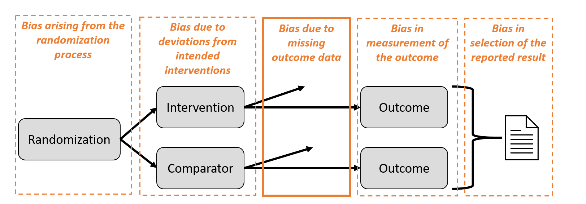
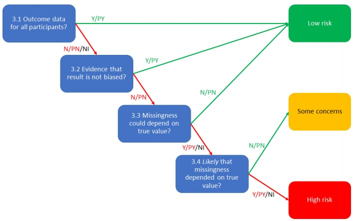
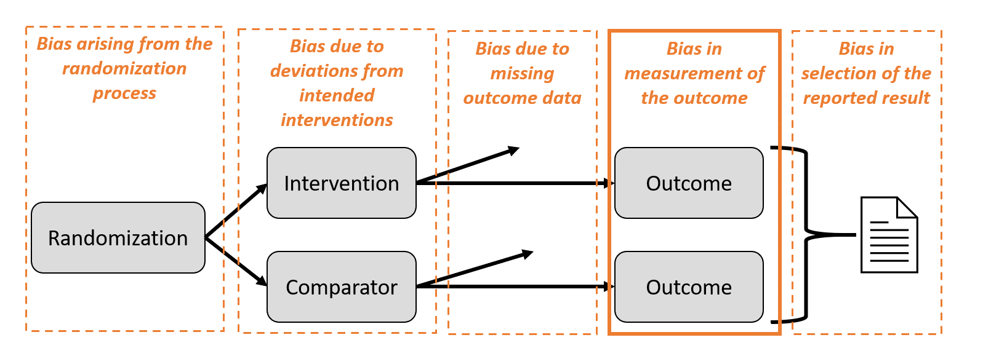
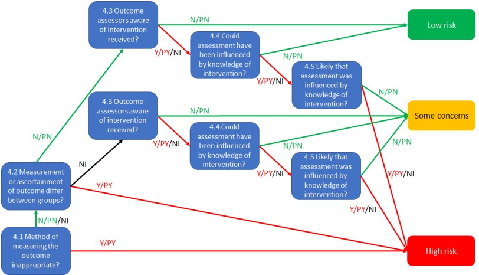
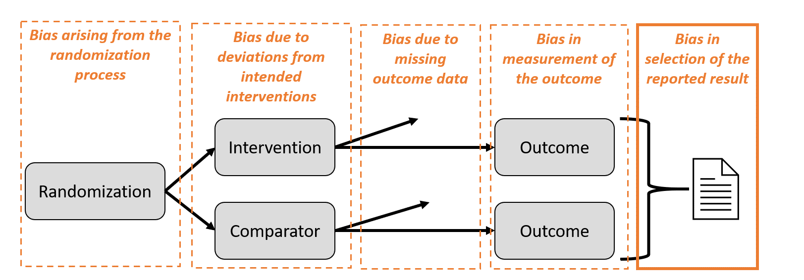
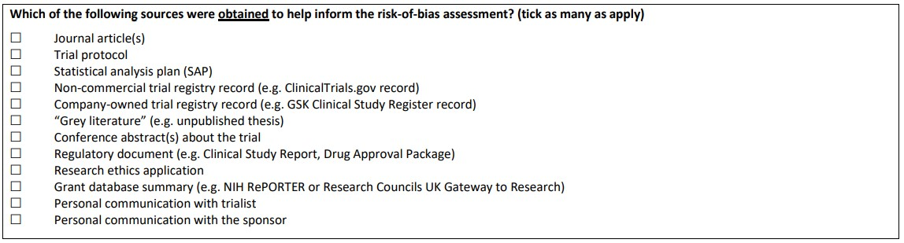
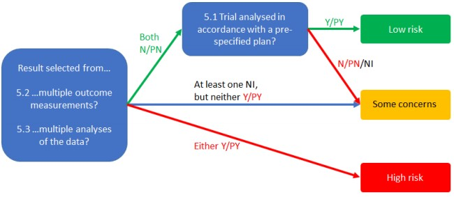
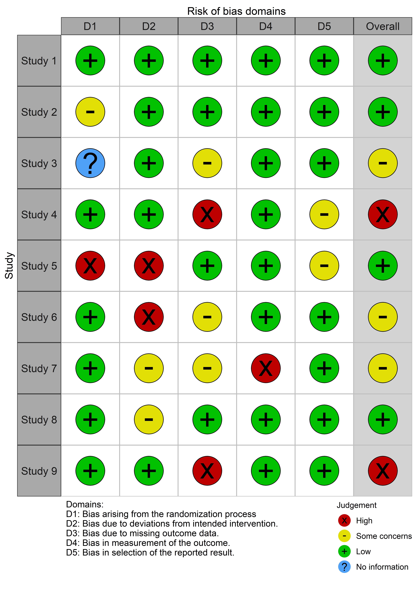

class: middle, center

```{r setup, include=FALSE}
options(htmltools.dir.version = FALSE)
knitr::opts_chunk$set(include = FALSE)
```

``` {r, echo = FALSE, message = FALSE}
htmltools::includeCSS("https://raw.githubusercontent.com/malcolmbarrett/kakashi/master/kakashi.css")
library(medrxivr)
cache <- TRUE
library(dplyr)
xaringanExtra::use_xaringan_extra(c("tile_view", "webcam"))
xaringanExtra::use_editable(expires = 1)
```

# Recap


???

Uploaded new version of slides - fixed some small isues

Covered:

* Bias as per ROB2

* Problems with original tool and motivation for second version

* Domain 1: issues with randomisation

* Domain 2: issues with deviations from intended interventions

---

class: inverse, center, middle

# Domain 3: <br>Bias due to missing outcome data

---

class: center, middle



---

## Missing outcome data

Several causes of missing outcome data:

* Participant __withdrew__, cannot be __found__ or __died__

???

Touched on this issues yesterday

Exclusions from analysis for reasons other than missing data should be dealt with in domain 2.

E.g. if patient has outcome data but did not attend all sessions and so was excluded from the analyses

--

* Participant __did not attend__ study visit at which outcome was measured

--

* Data __lost__ or __unavailable__

---

## What proportion of missingness is an issue?

No __hard and fast rule__ for allowable proportion of missing outcome data

--

If missing outcome data is causing bias, __strength of bias__ will increase as __amount of missing outcome data__ increases

---

## When is missing data an issue?

Need to consider:

* whether missingness is related to the __true value of the missing outcome__

???

Example: 

If participants who are suffering more from dementia (true value of the outcome) do not return for follow-up, then

missingness of the dementia outcome depends on it's true value

<hr>

--

* whether missingness is related to the __intervention group__

???

E.g. are side-effects, which cause participants to drop out, more likely in the intervention group?

<hr>

--

* whether the __intervention has an effect__


---

## Four scenarios

.left-column[**No bias**]


.right-column[Missingness unrelated to true values]

???

E.g. data missing because automatic measuring device failed for subset of participants

<hr>

--

.left-column[<br>**Bias**]

.right-column[<br>Missingness depends on true values and on intervention group]

<br>


???

Those with continuing symptoms more likely to drop out (reflects the true value, e.g. more depression) __AND__

more drop-outs in experimental group due to side effects 

<hr>

--

.left-column[<br><br>**No bias**__*__]

.right-column[<br>Missingness depends on true values but effects are identical in both groups]

.footer[__*__ Slightly more complicated - see RoB 2 guidance]


???

Those with continuing symptoms more likely to drop out (reflects the true value, e.g. more depression) __AND__

the experimental intervention has no effect

<hr>

--

.left-column[<br><br>**Likely bias**__*__]

.right-column[<br>Missingness depends on true values and effects of intervention and comparator differ]

???

Those with continuing symptoms more likely to drop out __AND__

the experimental intervention has an effect

<hr>

Not an easy area to consider

__*__ More complicated than this - see RoB2 guidance!

---

## Investigating missing outcome data

__Hard to assess directly__

--

Can use other sources of evidence:

* __Proportion__ of missing outcome data differs between intervention groups

--

* __Recorded reasons__ for missingness show missingess is related to true value

???

If reasons for drop-out are recorded, then this can provide evidence that missingness is related to true value

E.g. if in alcohol trial of maintaining sobriety, if people are placed in rehab and so can't attend follow-up, this reason shows missingness is related to sobriety result.

<hr>

--

* Reported reasons for missing outcome data __differ between the trial arms__

???

Shows missingness depends on the intervention

---

## Imputation does not solve all issues

Single imputation (e.g. "_Last observation carried forward_") should not be assumed to be correct for risk of bias assessment

If missingness depends on true value of outcome, multiple imputation __will not address bias__ unless missingness can be explained by measured variables

???

Won't fix issues with Missing not at random

Imputing only on intervention group is comparable to a complete-case analysis

If model is incorrectly specified, can cause issues and even increase bias

---

## Sensitivity analyses


Assumes something about the relationship between:

<br>

.center[__outcome missingness -> true value__]

<br>

If results robust, risk of bias will be .g[**Low**]

???

If the results do not change under different __assumptions__ about missing outcome data, then

Focus on assumptions, because more interested in what the authors thought were the range of reasonable values than what they actually did

---

## Result-based assessments

Domain is a good example of the motivation for __result-based assessments__

<br>

.box[
__Bias due to missing data can work differently at different time-points__
]

---

## Bias due to missing outcome data

.left-column[
<br>
<br>


.g[__Low__]

<br>
<br>
<br>
<br>
.r[__High__]

]

.right-column[

Outcome data available for (nearly) all participants

Evidence that result is not biased by missing outcome data

Missingness does not depend on true value

<hr>

Missingness likely depends on true value of outcome 

]

---

## Signalling questions

.left-column[
Any missing data?
<br>

Robust results?
<br>

Missingness depends on result?

]

.right-column[
**3.1** Were data for this outcome available for all, or nearly all, participants randomized?

**3.2** If .r[N/PN]/NI to 3.1: Is there evidence that the result was not biased by missing outcome data?

**3.3** If .r[N/PN] to 3.2: Could missingness in the outcome depend on its true value?  

**3.4** If .r[Y/PY]/NI to 3.3: Is it likely that missingness in the outcome depended on its true value?
]

???

Talk about distinction between could and likely here

Possible vs plausible

E.g. if all documented reasons for missingness are unrelated to true value, for example due to software failure, then __could not__ be related to true value

---

class: center, middle

## Domain 3 Algorithm


???

If outcome data available, fail fast to "Low risk"

---

class: middle, center

.pull-left[  ]

.pull-right[
<br>
<br>
<br>
.largest[__Questions?__]
]

---

class: inverse, center, middle

# Domain 4: <br> Bias in measurement of the outome

---

class: center, middle



---

## Bias in measurement of the outcome

Occurs when __measured value__ $\neq$ __true value__

Can be __differential__ or __non-differential__

__Common terms:__

* measurement error

* misclassification

???

Diff vs non-diff - depends on intervention or not

measurement error = continuous

misclass = dichotmous, categorical

---

## Non-differential error

Problems in measurement __present in both groups__, and __unrelated to trial group__

???

E.g. blood pressure (if device is broken)

--

Impact on __different outcome__ types:

* Continuous: __No bias__
* Dichotomous/categorical: __Bias towards the null__

???

Usually and mainly - highlight qualitfying nature of the bias statements

---

## Differential error

__Differential measurement of outcome__ in the intervention groups, introducing bias

???

E.g. depression assessed as lower in intervention

--

Only possible if assessors are __aware of the intervention received__

--

<br>

.box[
Blinding of outcome assessors is essential!
]

???

We consider this different to blinding of trial participants/personell, which is dealt with in domain 2

However, participants can also be the outcome assessor in self-administered outcome measurement

---

background-image: url("../images/blinding_effect.jpg")

.footer[Difference in effect when using blinded vs non-blinded observers. *Hróbjartsson et al. (2012) doi: 10.1136/bmj.e1119*]

---

## Blinding of outcome assessors

Not always __feasible__, e.g. _patient reported outcomes_

<br>

Often __not well reported__ 

<br>

Blinding terminology confusing: "__single__" vs "__double__" vs "__triple__"

---

## Bias in measurement of the outcome

.left-column[
<br>
.g[__Low__]

<br>
<br>
<br>
.r[__High__]

]

.right-column[

Blinding well implemented

No blinding, but objective outcome measurement

<hr>
<br>

No blinding and subjective measurement

]

---

## Signalling questions: Measurement

**4.1** Was the method of measuring the outcome inappropriate?  

???

Not assessing whether outcome is relevant, just whether it is appropriate

Inappropriate would include measures demonstrated to have poor validity

.g[Probably No/No] for most trials

--

**4.2** Could measurement or ascertainment of the outcome have differed between intervention groups? 

???

Measurement usually performed similarly in both groups

Two examples:

* Different outcome assessors

* Detection bias - if events are only captured at visits, and visits are more likely in intervention due to side effects, this is an issue. __Passive collection__


---

## Signalling questions: Blinding

**4.3** If .g[N/PN]/NI to 4.1 and 4.2: Were outcome assessors aware of the intervention received by study participants? 

???

Important to find out if outcome assessors were blinded

If yes, then .g[__Low risk of bias__]

Note: __double-blind__ doesn't necessarily include outcome assessors

<hr>

--

**4.4** If .r[Y/PY]/NI to 4.3: Could assessment of the outcome have been influenced by knowledge of intervention received?

???

Essentially distinguishing between objective (e.g. mortality) and subjective outcomes

<hr>

--

**4.5** If .r[Y/PY]/NI to 4.4: Is it likely that assessment of the outcome was influenced by knowledge of intervention received?

???

This is a more tricky question

Assessing trial context to see if hopes/hunches made it likely that measurement error occured

Issues:

* Very subjective outcome

* Very involved outcome assessors, with preconceptions

* New experimental intervention being compared with usual care/placebo

---

class: center

## Domain 4 Algorithm


???

Algorithm looks complicated, but lots of signalling questions are repeated in multiple sections

Note the only way to get to Low is if blinding was good

---

class: middle, center

.pull-left[  ]

.pull-right[
<br>
<br>
<br>
.largest[__Questions?__]
]

---

class: inverse, middle, center

# Suggested reponses for Domain 3

---

## Q 3.1 Were data for this outcome available for all, or nearly all, participants randomized?

--

**Response:** .r[__No__]

--

**Judgement:** At 4 months, missing data for 7 patients in the aerobic group (5 lost to follow-up, 2 refused to participate) and 13 patients in the relaxation group (9 lost to follow-up, 4 refused to participate). This is quite a large proportion of both groups, and higher in the relaxation group.

???

Note: imputed data should be regarded as missing data, and not considered as ‘outcome data’ in the context of this question.

---

## Q 3.2 If .r[N/PN]/NI to 3.1: Is there evidence that the result was not biased by missing outcome data?

--

**Response:** .r[__No__]

--

**Judgement:** No sensitivity analyses are presented, but were planned according to the protocol. 

???

Note that imputing the outcome variable, either through methods such as ‘last-observation-carried-forward’ or via multiple imputation based only on intervention group, should not be assumed to correct for bias due to missing outcome data.

---

## Q 3.3 If .r[N/PN] to 3.2: Could missingness in the outcome depend on its true value?

--

**Response:** .r[__Yes__]

--

**Judgement:** Not an objective outcome

---

## Q 3.4 If .r[Y/PY]/NI to 3.3: Is it likely that missingness in the outcome depended on its true value?

--

**Response:** .r[__Probably Yes__]

--

**Judgement:** More people were missing in the relaxation group. Possible that people allocated to this group were missing because their depression remained the same or got worse.

But you may disagree and judge this to be .g[__Probably No__]

---

class: center, middle


<br>

Domain-level judgement: .r[**High**]

---

class: inverse, middle, center

# Suggested reponses for Domain 4

---

## Q 4.1 Was the method of measuring the outcome inappropriate?

--

**Response:** .g[__No__]

--

**Judgement:** Beck Depression Inventory (BDI) is a widely used instrument for measuring the degree of depression.

---

## Q 4.2 Could measurement or ascertainment of the outcome have differed between intervention groups?

--

**Response:** .g[__No__]

--

**Judgement:** There is no indication that measurement of the outcome differed between intervention groups.

---

## Q 4.3 If .g[N/PN]/NI to 4.1 and 4.2: Were outcome assessors aware of the intervention received by study participants?

--

**Response:** .r[__Yes__]

--

**Judgement:** “The patient administered Becks Depression Inventory scale, which consists of 21 items that each can be scored from 0 to 3, is also included.”. (Protocol/design paper)
Patients were aware of their intervention allocation.

---

## Q 4.4 If .r[Y/PY]/NI to 4.3: Could assessment of the outcome have been influenced by knowledge of intervention received?

--

**Response:** .r[__Yes__]

--

**Judgement:** Knowledge of the assigned intervention could influence participant-reported outcomes such as depressive symptoms.

---
## Q 4.5 If .r[Y/PY]/NI to 4.4: Is it likely that assessment of the outcome was influenced by knowledge of intervention received?

--

**Response:** .g[__Probably No__]

--

**Judgement:** I think that it is unlikely that patients would complete the Beck Depression Inventory differently according to their assigned intervention.

But you may disagree and judge this to be .r[__Probably Yes__]

---

class: center, middle


Domain-level judgement: .sc[**Some concerns**]

---

class: inverse, center, middle

# Domain 5:  <br>Bias in the selection of the reported result

---

class: center, middle



---

# Selective reporting vs selective non-reporting

__Selective reporting__ (ROB2 Domain 5):

.center[

_Single result reported from <br>multiple planned in the protocol_

]

__Selective non-reporting__ (ROB-ME):

.center[

_Trial not reported (and so missing from <br>review/meta-analysis) because P > 0.05_

]

???

ROB-ME is beyond scope, but is available from riskofbias.info

---

## Bias in the selection of the reported result

.tricolumn[
.tricolhead[
### Outcome
]

Depression

]

.tricolumn[
.tricolhead[
### Measure
]
BDI

HAM-14

HAM-17

]

.tricolumn[
.tricolhead[
### Analysis
]

Difference in mean change at 4 weeks

Difference in mean change at 8 weeks

Difference in mean change at 12 weeks

]

???

Study planned multiple analyses, as per protocol paper

---


## Bias in the selection of the reported result

.tricolumn[
.tricolhead[
### Outcome
]

**Depression**

]

.tricolumn[
.tricolhead[
### Measure
]
**BDI**

HAM-14

HAM-17

]

.tricolumn[
.tricolhead[
### Analysis
]

Difference in mean change at 4 weeks

Difference in mean change at 8 weeks

**Difference in mean change at 12 weeks**

]

???

But only one is reported

---

## Bias in the selection of the reported result

Selection of result, on the basis of __magnitude__, __direction__ or __P-value__ from:

* Multiple __outcome measures__

???

Multiple scales, definition of an event, time points

<hr>

--

* Multiple __analyses__

???

Adjusted vs unadjusted

Different set of covairates

Final values vs change scores

Dichotmoisation/categorisation with different time points

---

## Identifiying bias in result selection

Compare published paper with __dated__, __pre-specified__ protocol

???

Main way to assess this domain is to 

Are outcome measures the same?

Have analysis methods changed?

Are changes explained? E.g. new cut-points for categorisation given distribution of the data

Date-stamped aspect is import, prevents retrospective registration

<hr>

--

If no protocol;

* compare __"Methods"__ versus __"Results"__

???


--

* Ensure consistency across __different reports__ of a study

???


--

.box[
__Important to gain access to all related documents, in order to get a full picture__
]

---

class: middle

 

???

List of possible evidence sources to look for

---

## Signalling questions

**5.1** Were the data that produced this result analysed in accordance with a pre-specified analysis plan that was finalized before unblinded outcome data were available for analysis?

<br>
*Is the numerical result being assessed likely to have been selected, on the basis of the results, from ...*

**5.2** ... multiple eligible outcome measurements (e.g. scales, definitions, time points) within the outcome domain?

**5.3** ... multiple eligible analyses of the data?


---

class: center, middle

## Domain 5 Algorithm



---

class: inverse, middle, center

# Overall RoB and <br> Integration into Synthesis

---

## Overall risk of bias

.left-column[.g[__Low risk of bias__]]
The study is judged to be at __low risk of bias__ for all domains _for this result_.

.left-column[.sc[__Some concerns__]<br><br>]

The study is judged to be at __some concerns__ in at least one domain _for this result_, and no domains are at high risk of bias

.left-column[.r[__High risk of bias__<br><br><br><br><br>]]

`#`1 - The study is judged to be at __high risk of bias__ in at least one domain _for this result_.<br>
`#`2 - The study is judged to have __some concerns__ for multiple domains in a way that substantially lowers confidence _in this result_.

---

## Incorporating bias assessments in analyses

__Cochrane Handbook, Chapter 7__:
“ It is not appropriate to present analyses and interpretations while ignoring flaws identified during the assessment of risk of
bias”

--

Suggested approaches:

1) Restrict primary analysis to studies at low risk of bias 

--

2) Explore the impact of RoB

--

3) Present all studies and provide a narrative discussion 

---

## Restrict to studies at low risk-of-bias

.pull-left[
Use overall judgement to __filter__ studies

Trade-off: __bias__ versus __precision__

Sensitivity analysis __using all studies__ encouraged
]

.pull-right[



]
???

What happens if biggest trial by far is at high risk of bias?

---

## Explore impact of risk of bias

Explore bias as __source of heterogeneity__

* Sub-group analyses

* Meta-regression


But be careful!

* Low power

* Difference in groups may not solely be due to bias

???

Problem is which result do you use

May be other sources of bias

---

class: inverse, middle, center

# Suggested reponses for Domain 5

---

## Q 5.1 Were the data that produced this result analysed in accordance with a pre-specified analysis plan that was finalized before unblinded outcome data were available for analysis?

--

**Response:** .g[__Probably Yes__]

--

**Judgement:** The protocol (design paper) appears to provide a pre-specified analysis plan. 

But concerns over timing of protocol submission

???

Protocol paper submitted for publication in August 2005 and accepted in July 2006, whereas recruitment to the trial took place from January 2005 to July 2006. 

It is possible that the document was edited to react to seeing results. 

However, here we presume that such edits were not made.

---

## Q 5.2 Is the numerical result being assessed likely to have been selected, on the basis of the results, from multiple eligible outcome measurements (e.g. scales, definitions, time points) within the outcome domain?

--

**Response:** .g[__No__]

--

**Judgement:** These were pre-specified in the design paper and presented in the paper.

---

## Q 5.3 Is the numerical result being assessed likely to have been selected, on the basis of the results, from multiple eligible analyses of the data?
 
--
 
**Response:** .g[__Probably No__]

--

**Judgement:** There is no indication of multiple analyses of the data, and the analysis method used for this outcome in the full trial report matches that in the design paper.

---

class: center, middle


<br>

Domain-level judgement: .g[**Low**]

---

class: inverse, center, middle

# Demo of Excel visualisation option


